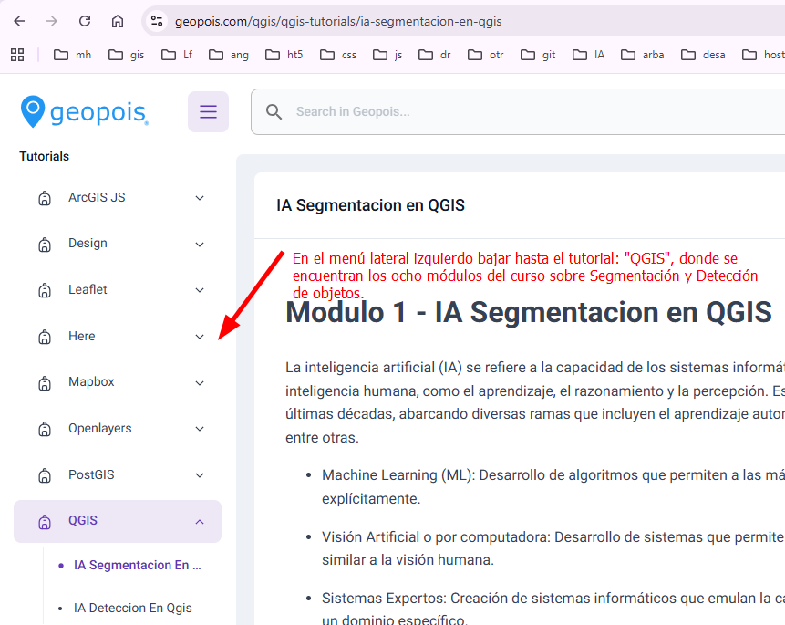

# qgisIaDetection
 

## Plugin DeepNess:
<a href="https://qgis-plugin-deepness.readthedocs.io/en/latest/" target="_blank">Página del plugin DeepNess</a>

## Página de Roboflow:
<a href="https://roboflow.com/" target="_blank">Página de Roboflow</a>

## Desarrollo de todos los temas de esta presentación en el curso completo sobre Segmentación y Detección de objetos con Deep Learning que se encuentra en Geopois:

- <a href="https://www.geopois.com/qgis/qgis-tutorials/ia-segmentacion-en-qgis" target="_blank">Segmentación y Detección de objetos</a>
 
- 

